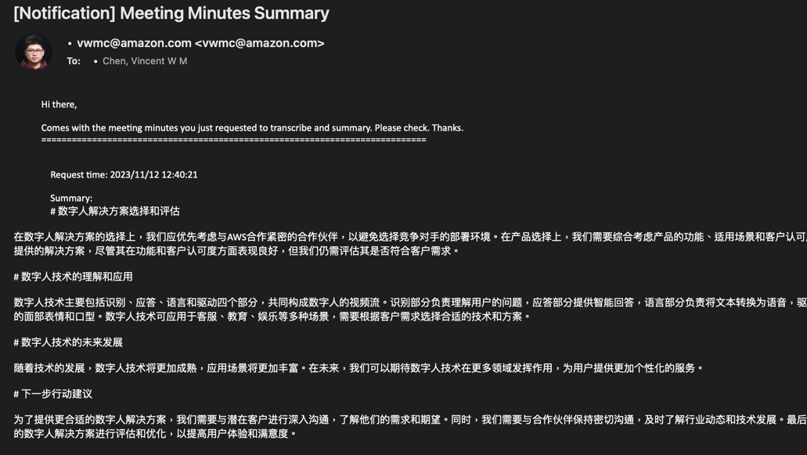

## Extension - Automatic Speech Recognition (ASR)

In this section, you will learn how to deploy an ASR stack with UI and backend services.

#### Typical Use Case of ASR - Meeting Minutes Summarization and Notification


1. End user to get recording files (for meeting)
2. End user upload an audio file to ASR tool
3. ASR tool auto transcribe and extract text
4. Use LLM to summarize meeting minutes and key points
5. Format content (like email structure)
6. Send email notification to users

### End goal of ASR stack:

1. Provide a UI for end user to upload audio file, and input recipients (who eventually receives email) <br/>
    <br/><br/>
2. Provide an API endpoint serving for short-streaming transcription or large-file transcription <br/>
   

   ```shell
   ## It supports two API: "/" & "/transcribe"
   
   ## Validate if API works, returning "Hello World"
   curl -X GET http://<ALB-fqdn>/
   
   ## ASR request, returning transcription
   ## /transcribe requires "audio_file_location" parameter, which audio needs to be uploaded to S3 in advance
   curl --max-time 900 -X POST http://<ALB-fqdn>/transcribe \
         -H "Content-Type: application/json" 
         -d '{"audio_file_location":"s3://<S3_bucket_that_stores_audio>/asr_source/14s_quick_voice.mp3"}' \
         -w '\nEstablish Connection: %{time_connect}s\nTTFB: %{time_starttransfer}s\nTotal: %{time_total}s\n'
   ```
   <br/>

3. Transcription will be stored in DynamoDB for ongoing usage <br/>
    <br/><br/>

4. Utilize Amazon Simple Email Service (SES) to notify users when summarization is ready
   Please refer [SES Setup Guide](https://docs.aws.amazon.com/ses/latest/dg/setting-up.html) to configure. <br/>

   Recipients will receive email similar to below: <br/>
    <br/><br/>

### How to Configure

1. In `cdk.json`, turn on `enable_asr_model_feature`
   ```json
   "enable_asr_model_feature": true,
   ```
   Turn on `turn_on_email_notification` set to `true`, if __SES__ properly setup. Otherwise please keep it as `false`.
   Update the `source_sender` to email you verified from SES.
   ```json
   "turn_on_email_notification": "false",
   "source_sender": "<your SES verified email>"
   ```
2. Run same command to synth and deploy.
   ```shell
   cdk synth
   cdk deploy --all --require-approval never
   ```
3. For components of ASR stack, it will take around __15 mins__ to provision and configure.

### Resource Detail of ASR

| Components               | Description                                                                                                           | Specification                                                                            |
|--------------------------|-----------------------------------------------------------------------------------------------------------------------|------------------------------------------------------------------------------------------|
| ASR Server               | ASR backend service behind a AutoScaling Group. Both API and UI will run on this server.                              | - G5.xlarge with 100 GB Disk<br/>- AMI: Deep Learning AMI GPU PyTorch 2.0.1              |
| VPC                      | An individual VPC will be created for hosting ASR related resources                                                   | Public subnet only.                                                                      |
| Application LoadBalancer | Two ALB will be created: 1 for API, 1 for UI                                                                          | ALB Idle timeout set to 4000 seconds                                                     |
| ASR Stream Processor     | Lambda function accept DynamoDB Stream to trigger either a)ASR Content Processor or b) Email notification.            | Async invocation                                                                         |
| ASR Content Processor    | Lambda function pass transcription to LLM for summarization                                                           | RAM:5G; Timeout: 15min; Layer with Langchain==0.0.334                                    |
| UI Docker Image          | Docker image for serving ASR UI. This image will be built when ASR Server provisioning. Also can be built beforehand. | Detail information refer `deployment/lib/asr-ui/Dockerfile`                              |
| ASR Model                | Model used for implementing ASR.                                                                                      | Use Faster-Whisper, large-v2 (converted into CTranslate base on OpenAI/Whisper:large-v2) |
| VAD Model                | Voice Activity Detection Model                                                                                        | silero-vad (https://github.com/snakers4/silero-vad)                                      |
| ASR Content Storage      | Storage all transcription for ongoing usage                                                                           | DynamoDB                                                                                 |
| LLM Model                | LLM Model uses for producing summarization and response                                                               | Baichuan2-13B on Sagemaker Inference Endpoint (g5.2xlarge)                               |
| Long Text Processor      | Mechanism of handling long transcription for LLM summarization                                                        | MapReduceChain of LangChain (refer `lambda/asr_content_processor` `line 80-115`          |